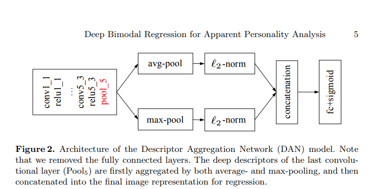

# First-Impression

This solution is the embodiment of the paper [Deep Bimodal Regression for Apparent Personality Analysis](https://cs.nju.edu.cn/wujx/paper/eccvw16_APA.pdf). The solution is based on their framework and has the potential of being altered into an API for dynamic use.

This problem is a challenge on “first impressions”, which referes to the personality analysis of a person using just 15 seconds of footage but it can be extended to higher performance abilities as the time of the interview increases. Also it is catered through a huge dataset with 1.5 Lakh seconds of footage with 6.1 frames per second implying more than 10 Lakh frames for training and testing the model.

The traits to be recognized will correspond to the “big five” personality traits used in psychology and well known of hiring managers using standardized personality profiling:
* Extroversion
* Agreeableness
* Conscientiousness
* Neuroticism
* Openness to experience.


The model used is called `Descriptor Aggregation Network` called DAN in short.



What distinguishes DAN from the traditional CNN is: the fully connected layers are discarded, and replaced by both average- and max-pooling following the last convolutional layers (Pool5). Meanwhile, each pooling operation is followed by the standard L2-normalization. After that, the obtained two 512-d feature vectors are concatenated as the final image representation. Thus, in DAN, the deep descriptors of the last convolutional layers are aggregated as a single visual feature. Finally, a regression (fc+sigmoid) layer is added for end-to-end training.


## Getting Started 

Follow the instructions for the execution pipeline but make a note of the prerequisites

### Prerequisites

* [Python3](https://www.python.org/downloads/release/python-373/) - Python version 3.7.3
* [Numpy](http://www.numpy.org/) - Multidimensional Mathematical Computing
* [Tensorflow 1.14.0](https://www.tensorflow.org/) - Deep Learning python module
* [Pandas](https://pandas.pydata.org/) - Loading csv files
* [Cha-Learn Dataset](http://chalearnlap.cvc.uab.es/dataset/24/description/) - Dataset for this problem
* [Pretrained VGG-Face Model](http://www.vlfeat.org/matconvnet/models/vgg-face.mat) Pretrained Vgg-face model
* [Pillow 6.1.0](https://pypi.org/project/Pillow/) Python Imaging Library
* [OpenCV 3.4.1](https://breakthrough.github.io/Installing-OpenCV/)  library used for Image Processing
* [ffmpeg](https://ffmpeg.zeranoe.com/builds/ ) software suite of libraries and programs for handling video, audio, and other multimedia 
files and streams. Also add the same in your Path using Environment Varibles.
* [python_speech_features](https://pypi.org/project/python_speech_features/) This library provides common speech features for ASR including MFCCs and filterbank energies

### Installing

Clone the repository

```
git clone https://github.com/shrey912/IGT-Internship.git
```

[Download the dataset](https://chalearnlap.cvc.uab.cat/dataset/24/description/) and extract it into a new "data" directory with all 75 training zip files and 25 validation zip files. The extraction of those files is done by the execution of the following code.

[Download](http://www.vlfeat.org/matconvnet/models/vgg-face.mat) Pretrained Vgg-face model and move it to the root directory

Run the requirements.txt 

```
pip install -r requirements.txt
```
Run the Video_to_Image.py file to scrape the images from the videos and save it to a new ImageData directory

```
python Video_to_Image.py
```

Run the vid_to_wav.py file to extract audio(.wav) files from the videos and save it to a new VoiceData directory

```
python vid_to_wav.py
```
Write the records using serialization. For that execute the following code

```
python Write_Into_TFRecords.py
```
Run the feat_extraction_from_wav.py file to form a data pipeline by saving the all the train audio into train_audio_full.tfrecords file , all the validation images into val_audio_full.tfrecords to load it later during training

```
python feat_extraction_from_wav.py
```

Start the training by running the following command

```
python train.py
```

The final accuracy for the model is 0.9130 and accuracy for every trait is as follows:
*	Extroversion: 0.9133
*	Agreeableness: 0.9126
*	Consciousness: 0.9166
*	Neuroticism: 0.9100
*	Openness: 0.9123


## Acknowledgments

* [paper](https://cs.nju.edu.cn/wujx/paper/eccvw16_APA.pdf) - Implemented paper
* [TfRecord Data Pipeline](http://machinelearninguru.com/deep_learning/data_preparation/tfrecord/tfrecord.html#read) - Used to make data pipeline
* [VGG16 in TensorFlow](https://www.cs.toronto.edu/~frossard/post/vgg16/) - Used in DAN 
* [Author's code](https://github.com/tzzcl/ChaLearn-APA-Code#2-extract-audio-feature-from-video)
* [Seema Ma'am](https://www.linkedin.com/in/gangwarseema/) for giving me the opportunity to intern and for assigning me this project
